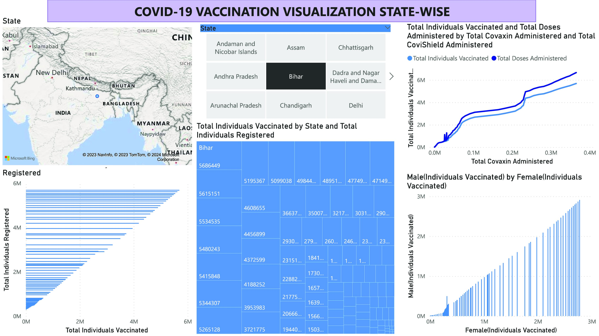

# 🅲🅾🆅🅸🅳_19_Vaccination_🅳🅰🆂🅷🅱🅾🅰🆁🅳

## 𝓞𝓿𝓮𝓻𝓿𝓲𝓮𝔀 :
This repository contains code for a COVID-19 vaccination analysis dashboard. It provides visualizations and insights state wise into the global pandemic.

## 𝓕𝓮𝓪𝓽𝓾𝓻𝓮𝓼 :
- Interactive maps
- ie series charts
- Vaccinated statistics

## 𝓣𝓮𝓬𝓱𝓷𝓸𝓵𝓸𝓰𝓲𝓮𝓼 𝓤𝓼𝓮𝓭 :
- Backend: Excel
- Data Visualization: Power BI 

## 𝓢𝓬𝓻𝓮𝓮𝓷𝓼𝓱𝓸𝓽𝓼 :

## 𝓓𝓪𝓽𝓪 𝓢𝓸𝓾𝓻𝓬𝓮𝓼 :
- World Health Organization (WHO)

## 𝓐𝓬𝓬𝓸𝓶𝓸𝓭𝓪𝓽𝓲𝓸𝓷 :
- Myself
  
## 𝓒𝓸𝓷𝓽𝓻𝓲𝓫𝓾𝓽𝓲𝓸𝓷 :
Feel free to contribute by opening issues or Visualisation.

## 𝓟𝓻𝓸𝓳𝓮𝓬𝓽 𝓖𝓸𝓪𝓵 :
-  The goal is to provide user-friendly interface for individuals and Healthcare professionals who can track vaccination process.

## 𝓐𝓬𝓴𝓷𝓸𝔀𝓵𝓮𝓭𝓰𝓮𝓶𝓮𝓷𝓽𝓼 :
Special thanks to the data providers and contributors to open-source libraries used in this project.

## 𝓛𝓲𝓬𝓮𝓷c𝓮   :
Tanmay Raj©
